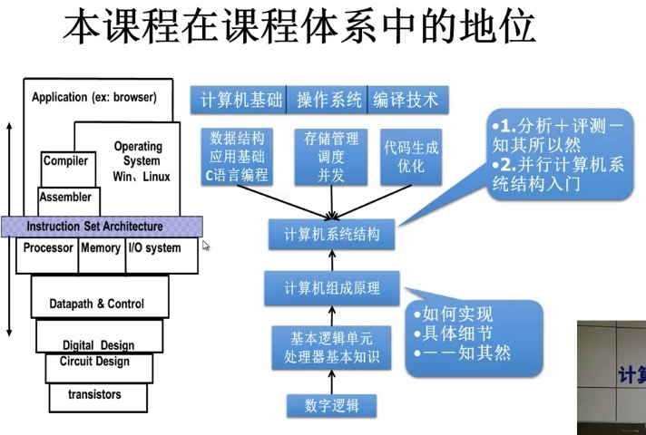
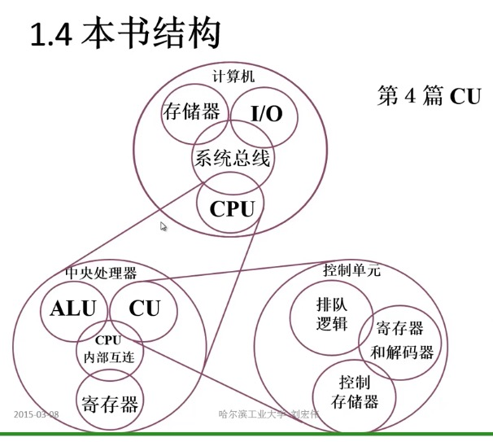

# ccpnotes
The computer composition principle notes

# 计算机组成原理 机器

- 基本部件的结构和组织方式
- 基本运算的操作原理
- 基本部件和单元的设计思想

`参考教材`
- 计算机组成原理
- 数字设计和计算机体系结构

## 课程内容

- 概论
- 计算机系统的硬件架构
    - CPU
    - 系统总线
    - I/O
    - 存储器
- CPU
    - ALU
    - CU
    - 寄存器
    - CPU内部互连
- CU
    - 排队逻辑
    - 寄存器和解码器
    - 控制存储器

## 课程目录

- 计算机组成原理之机器
    1. 计算机系统的基本概念
    2. 总线
    3. 存储器
    4. 输入输出系统
- 计算机组成原理之数字
    1. 计算机中数的表示
    2. 计算机的运算方法和运算器
- 计算机组成原理之CPU
    1. 指令系统
    2. CPU的结构和功能
    3. 控制单元
    4. 控制单元的设计

- 第1章 计算机系统概论
- 第2章 计算机的发展及应用
- 第3章 系统总线
- 第4章 存储器
- 第5章 输入输出系统
- 第6章 计算机的运算方法
- 第7章 指令系统
- 第8章 CPU的结构和功能
- 第9章 控制单元的功能
- 第10章 控制单元的设计
