# 第1章 计算机系统概论

## 1.1 计算机系统简介

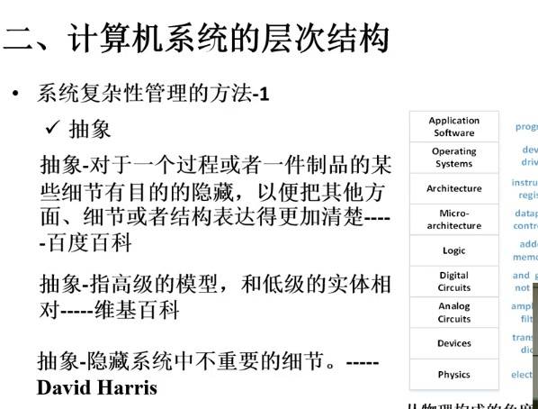

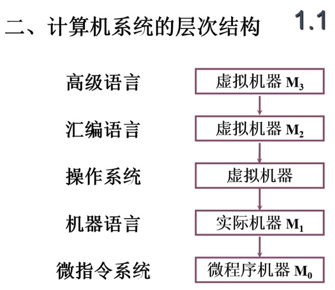

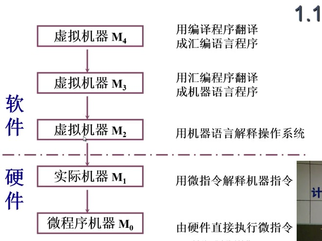

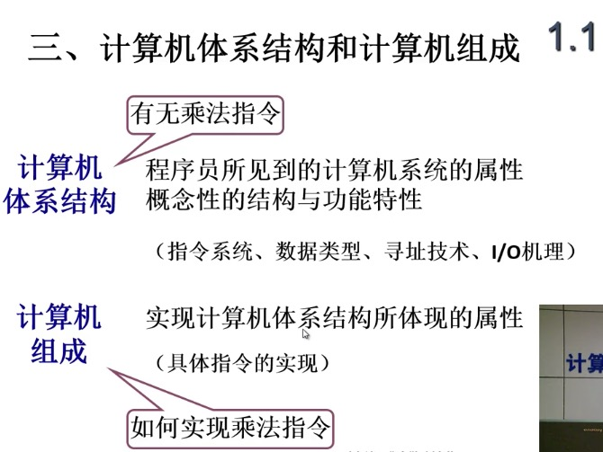

[1.1计算机系统简介.pdf](/_attachments/2018-06-09/1.1计算机系统简介.pdf)

## 1.2 计算机的基本组成

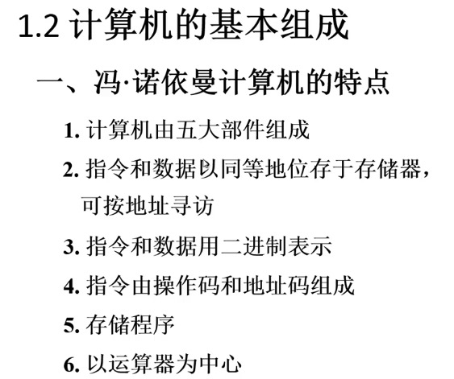

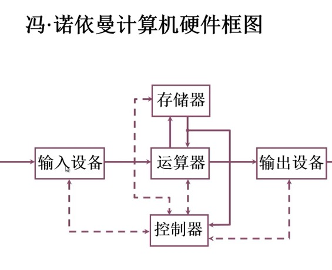

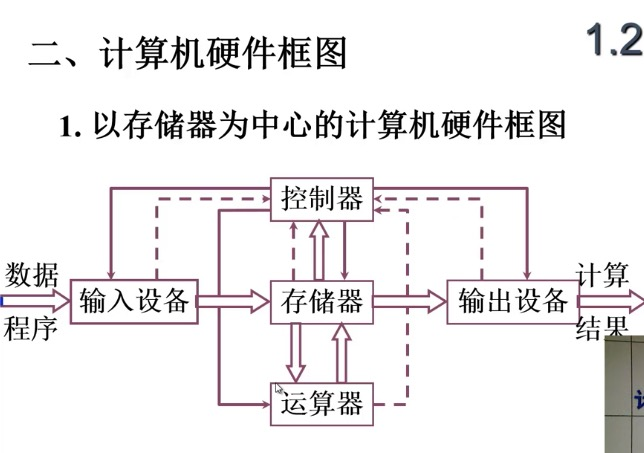

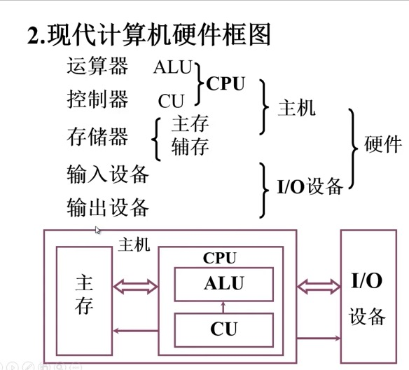

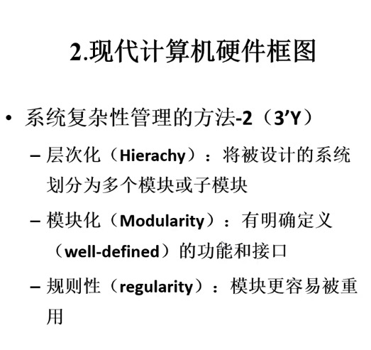

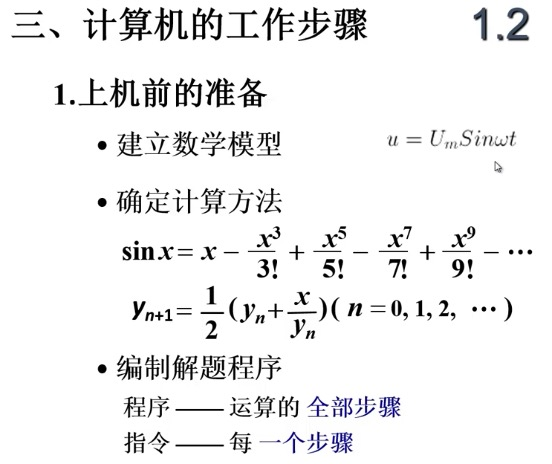

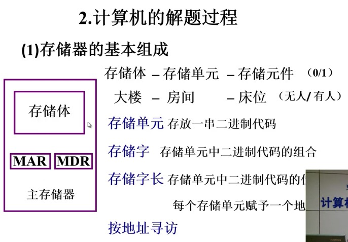

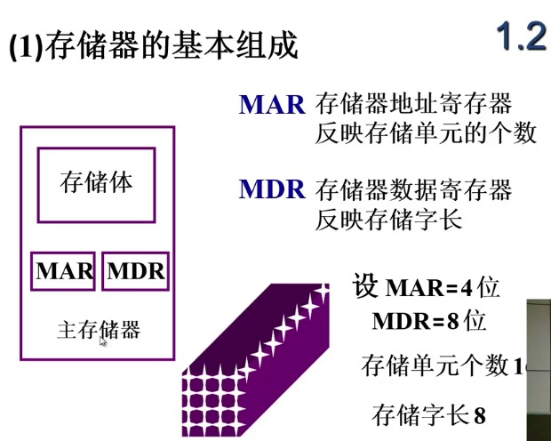

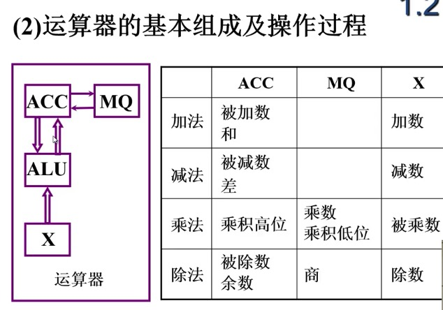

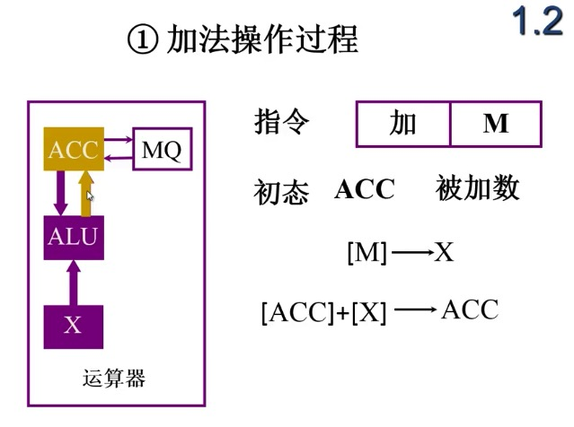

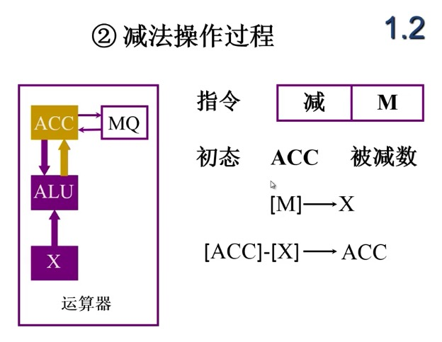

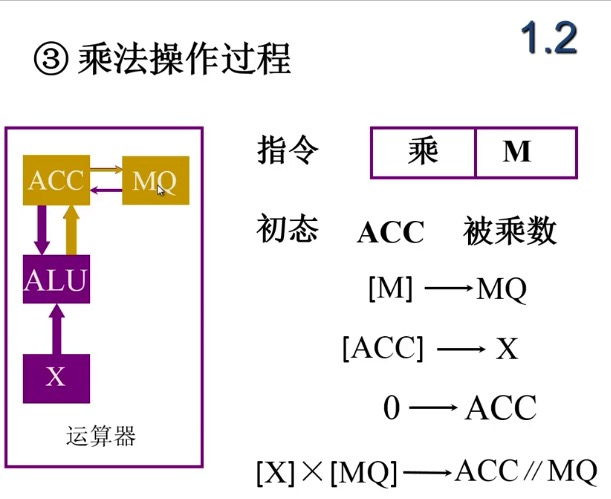

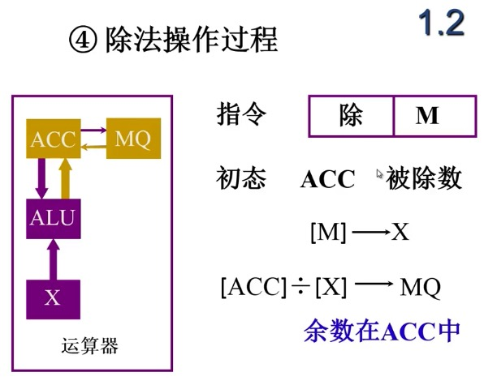

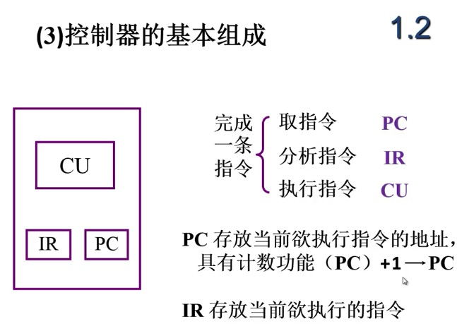

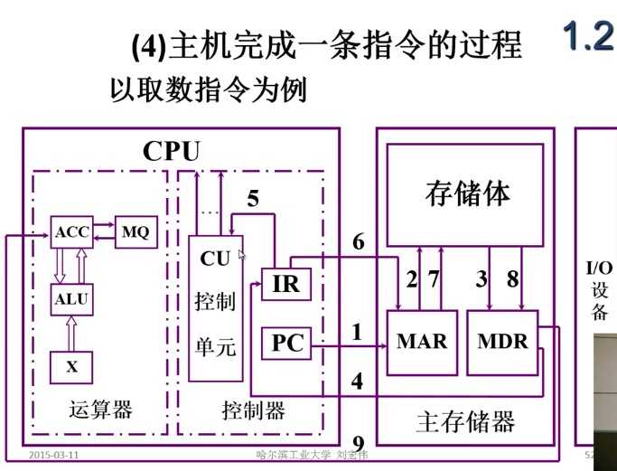

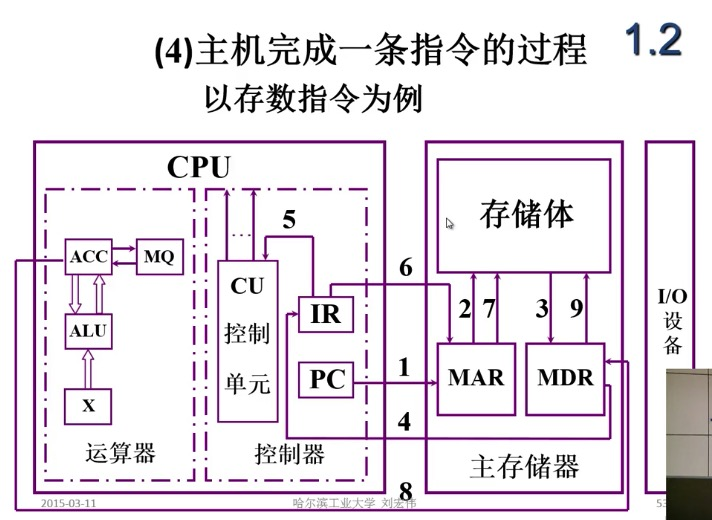

[1.2计算机的基本组成.pdf](/_attachments/2018-06-09/1.2计算机的基本组成.pdf)

## 1.3 计算机硬件的主要技术指标

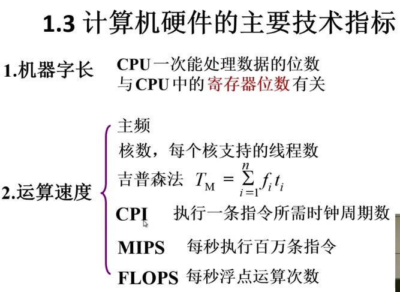

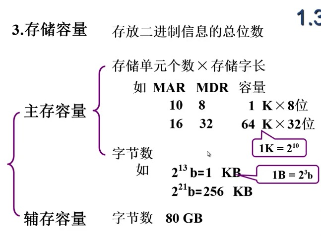

[1.3计算机硬件的主要技术指标.pdf](/_attachments/2018-06-09/1.3计算机硬件的主要技术指标.pdf)

－－－－－

[计算机组成原理之机器-week1.pdf](/_attachments/2018-06-09/计算机组成原理之机器-week1.pdf)

