# 系统总线

## 3.1 总线的基本概念

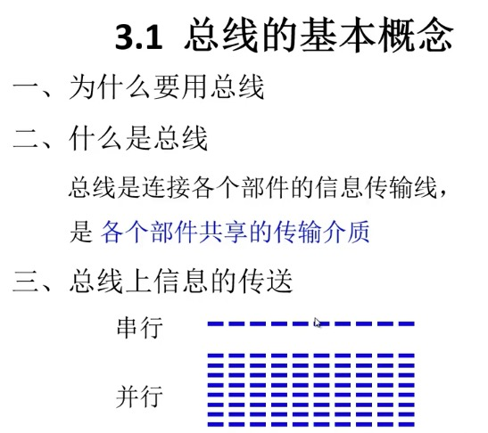

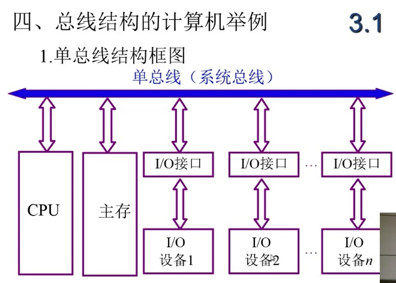

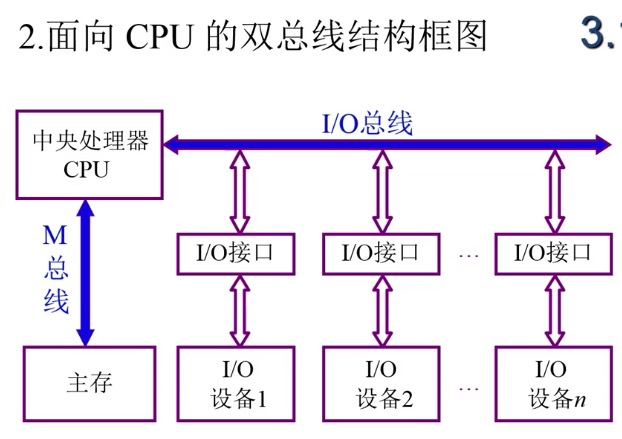

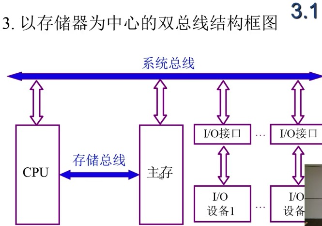

## 3.2 总线的分类

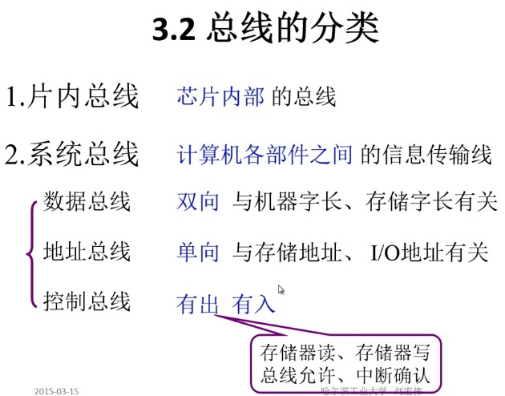

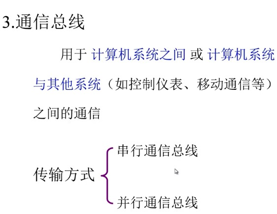

## 3.3 总线特性及性能指标

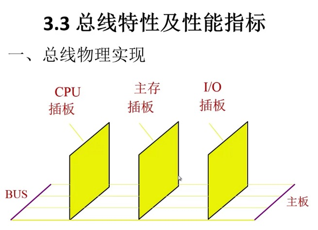

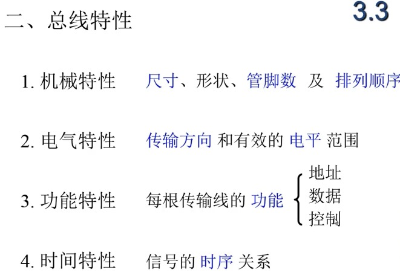

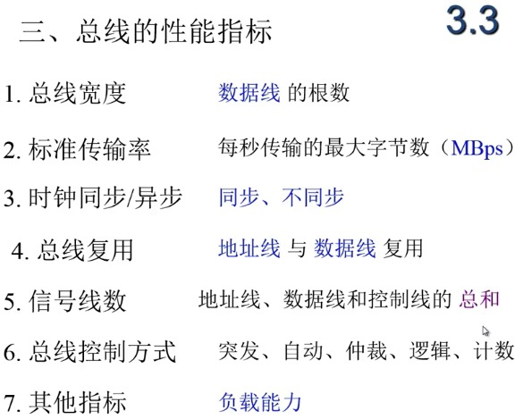

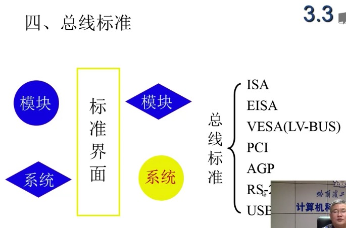

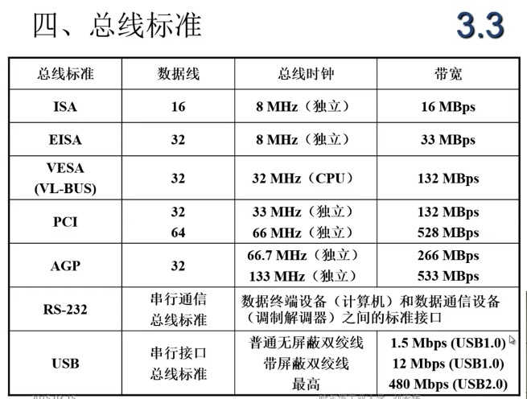

## 3.4 总线结构

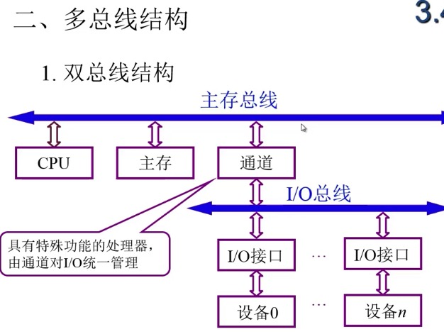

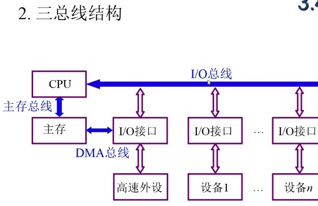

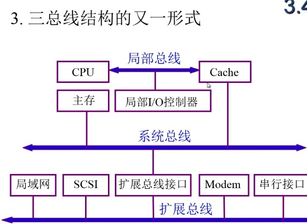

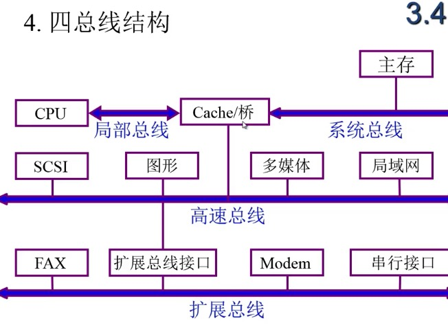

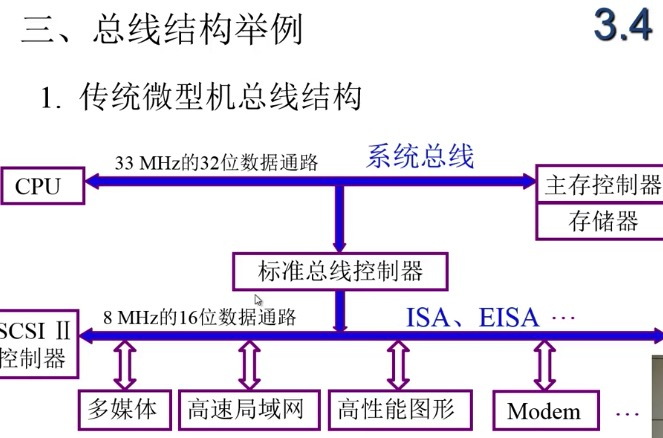

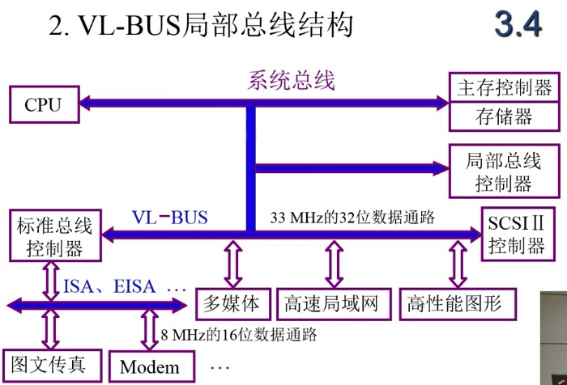

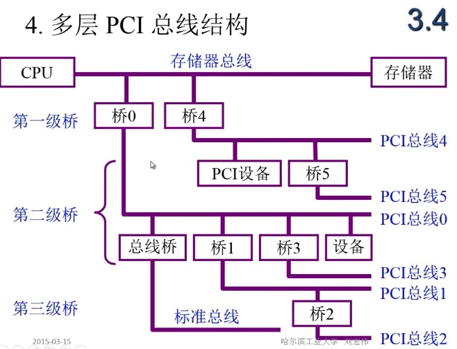

## 3.5 总线控制

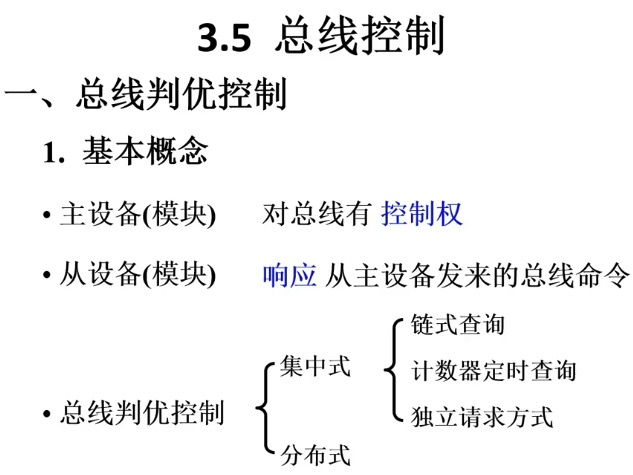

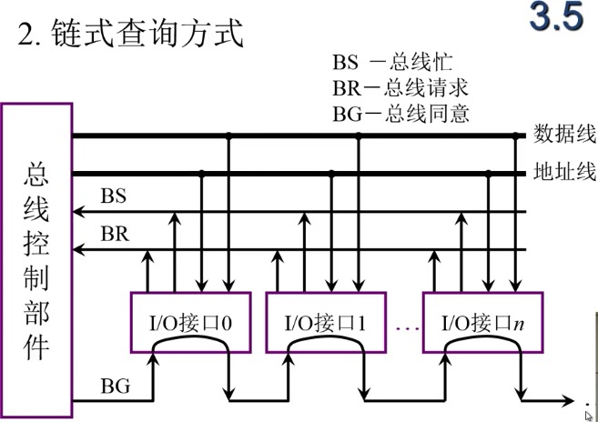

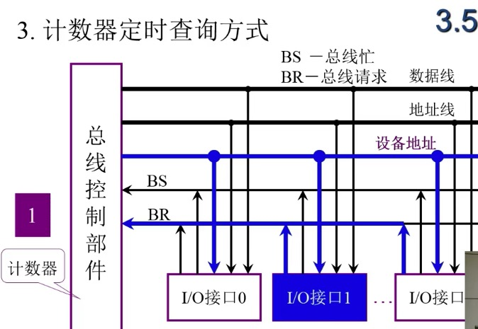

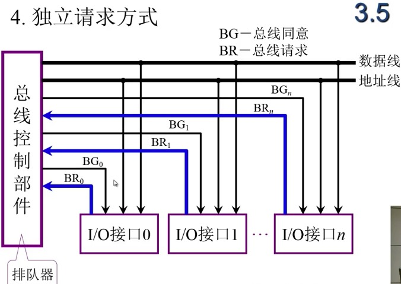

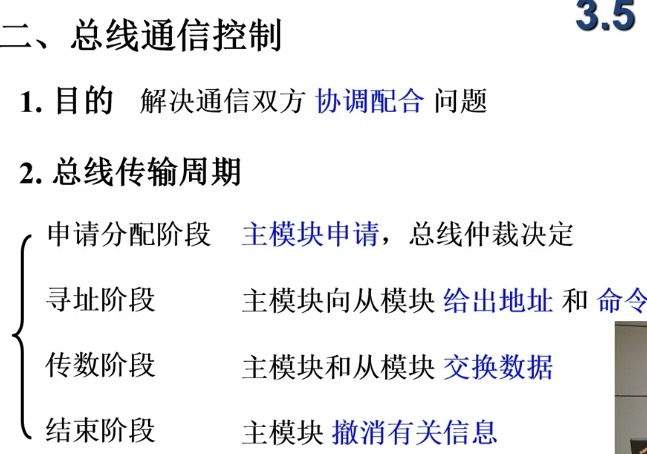

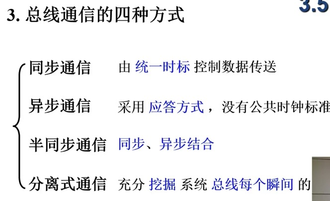

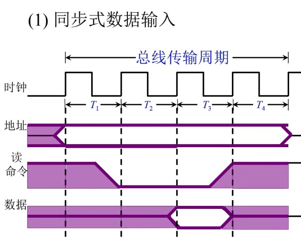

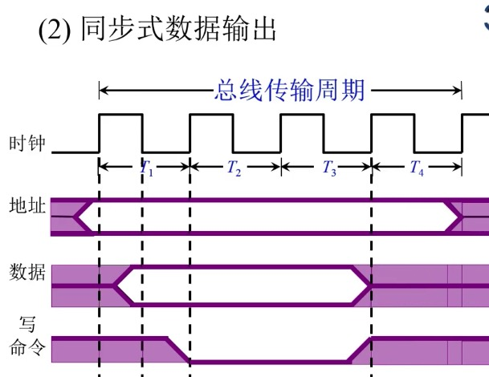

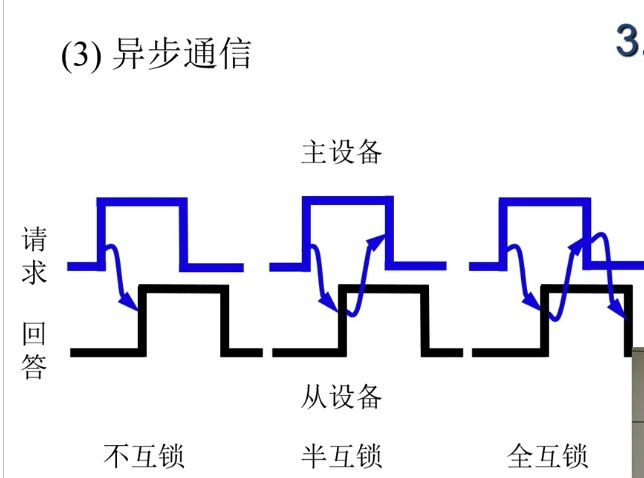

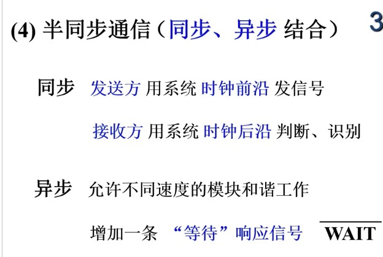

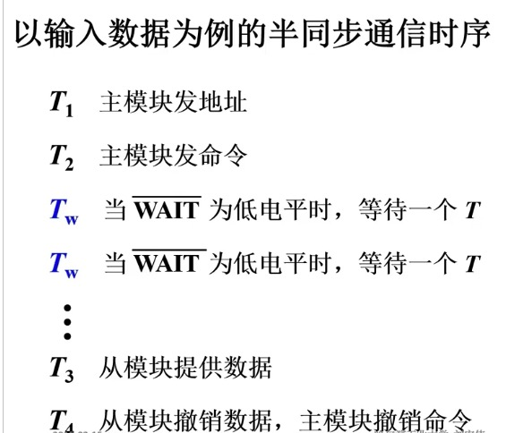

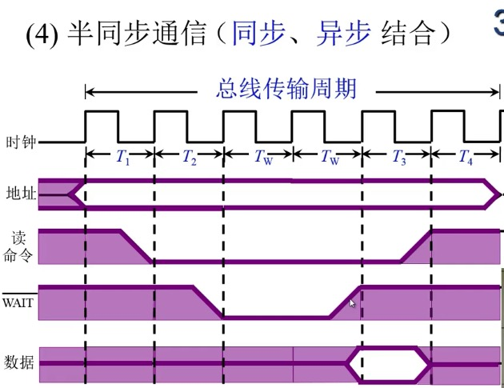

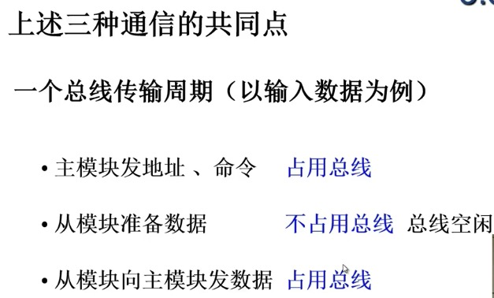

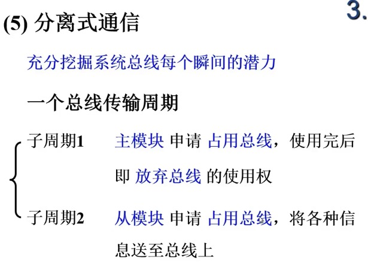

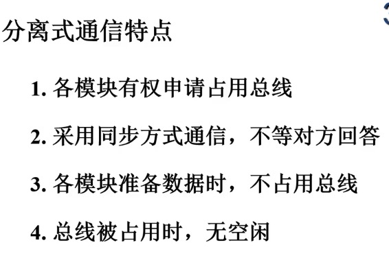

[计算机组成原理之机器-week3.pdf](/_attachments/2018-06-14/计算机组成原理之机器-week3.pdf)

